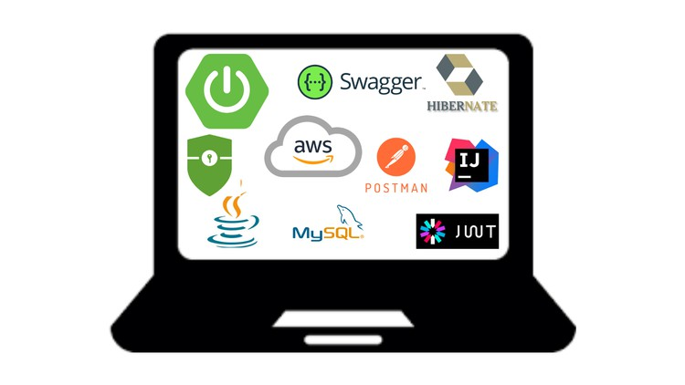

# Descripción del Proyecto

Este proyecto consiste en una *Aplicación de Blog* utilizando *Spring Boot* y el motor de plantillas thymeleaf. La aplicación permite realizar operaciones CRUD para la gestión de posts, y comentarios asociados a los posts

## Características

- *CRUD Completo:* Los usuarios administradores pueden crear, leer, actualizar y eliminar publicaciones de blog, así como comentarios y perfiles de usuario.
  Los usuarios con rol invitado solamente pueden gestionar sus propios comentarios y visualizar posts.
- *Spring Boot 3 y Thymeleaf*: Se utiliza Spring Boot para el backend y Thymeleaf para el frontend, integrando estas tecnologías para crear una aplicación web dinámica y atractiva.
- *Spring Security 6*: Implementa autenticación y autorización para asegurar la aplicación web.
- *Spring Data JPA & MySQL*: Utiliza Spring Data JPA para interactuar con una base de datos MySQL, implementando relaciones complejas como One to Many y Many to One.
- *Validación de Formularios*: validación de formularios y datos de beans utilizando Hibernate Validator.
- *Bootstrap CSS 5*: Emplea Bootstrap 5 para diseñar y estilizar tu aplicación web, haciéndola responsiva y moderna.
- *Arquitectura de Tres Capas*: Se basa en la arquitectura de tres capas: Controlador, Servicio y Repositorio/DAO.
- *Seguridad y Gestión de Usuarios*: Implementa características de seguridad como registro, inicio de sesión y cierre de sesión.
- *Filtrado y Búsqueda*: Implementar funciones de filtrado y búsqueda dentro de tu aplicación.
- *Mapeo Personalizado*: Utiliza un mapeador personalizado para la conversión entre entidades y DTOs.

## Tecnologías Utilizadas

- Spring Boot 3
- Spring MVC
- Spring Security 6
- Thymeleaf
- Spring Data JPA
- MYSQL
- Bootstrap
- HTML5

